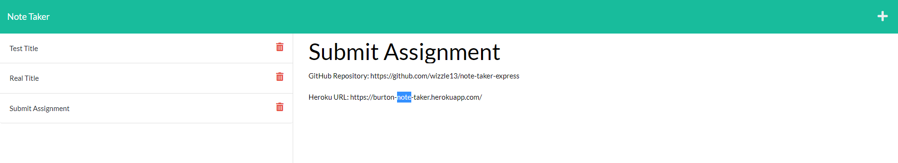

 # Note Taker Express
  

  
  
  ## Description
  challenge is to create an application called Note Taker that can be used to write and save notes. This application will use an Express.js back end and will save and retrieve note data from a JSON file.

  ### Tools and Languages used
  

  
 ## Screenshots
 

## Links
GitHub Repository: https://github.com/wizzle13/note-taker-express

Heroku URL: https://burton-note-taker.herokuapp.com/

  &copy;2020 by Chris Burton